# Testing

> [!NOTE]  
> Return back to the [README.md](README.md) file.

## Code Validation

### HTML

I have used the recommended [HTML W3C Validator](https://validator.w3.org) to validate all of my HTML files.
Direct links to the results have been added unless made impossible due to login/authentication restrictions.

| Directory | File | URL | Screenshot | Notes |
| --- | --- | --- | --- | --- |
| library | [add_book.html](https://github.com/Gary-Burke/book-lovers-market/blob/main/library/templates/library/add_book.html) | [Results Link](https://validator.w3.org/nu/?doc=https%3A%2F%2Fbook-lovers-market-4a712f119c48.herokuapp.com%2Flibrary%2Fadd%2F) | 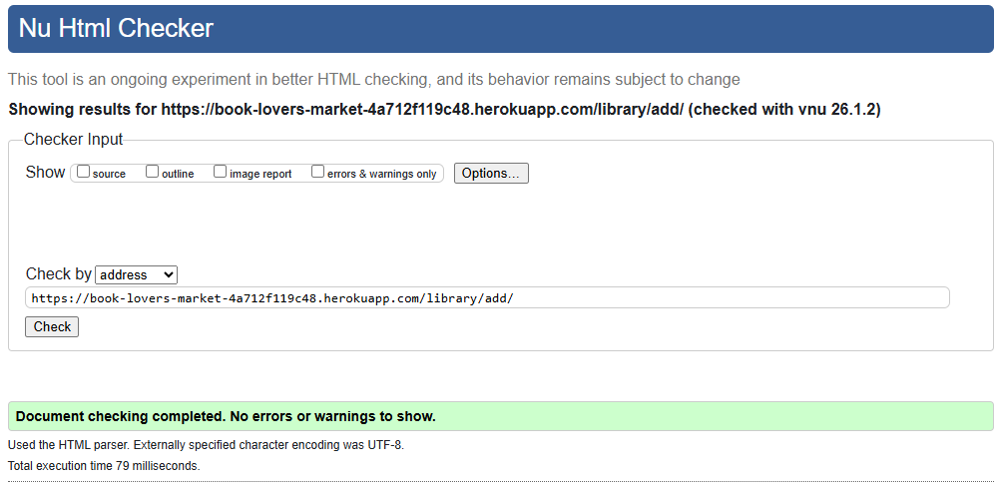 | No errors or warnings |
| library | [edit_book.html](https://github.com/Gary-Burke/book-lovers-market/blob/main/library/templates/library/edit_book.html) | n/a | 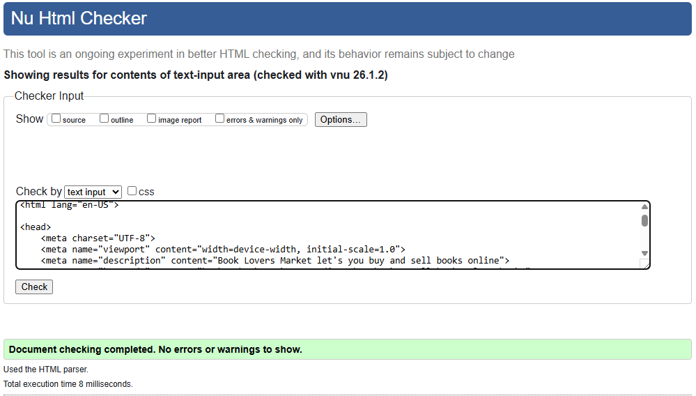 | No errors or warnings |
| library | [library.html](https://github.com/Gary-Burke/book-lovers-market/blob/main/library/templates/library/library.html) | n/a | 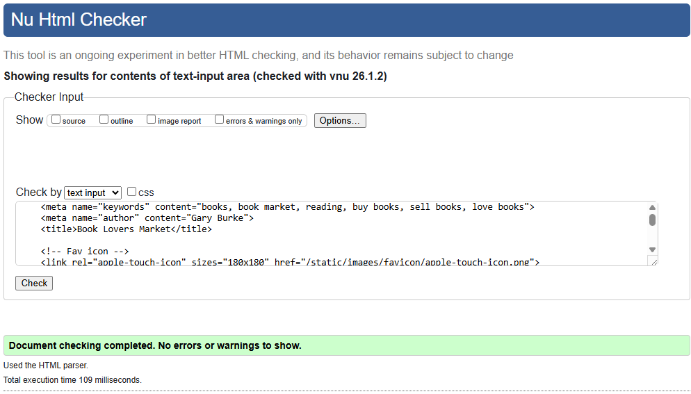 | No errors or warnings |
| library | [sales.html](https://github.com/Gary-Burke/book-lovers-market/blob/main/library/templates/library/sales.html) | [Results Link](https://validator.w3.org/nu/?doc=https%3A%2F%2Fbook-lovers-market-4a712f119c48.herokuapp.com%2Flibrary%2Fsales%2F) | 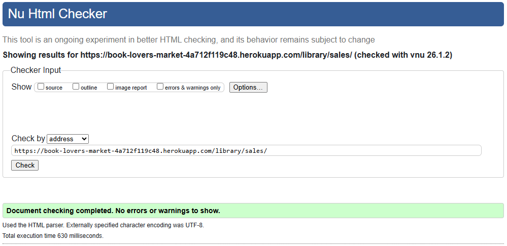 | No errors or warnings |
| pages | [about.html](https://github.com/Gary-Burke/book-lovers-market/blob/main/pages/templates/pages/about.html) | [Results Link](https://validator.w3.org/nu/?doc=https%3A%2F%2Fbook-lovers-market-4a712f119c48.herokuapp.com%2Fabout%2F) | 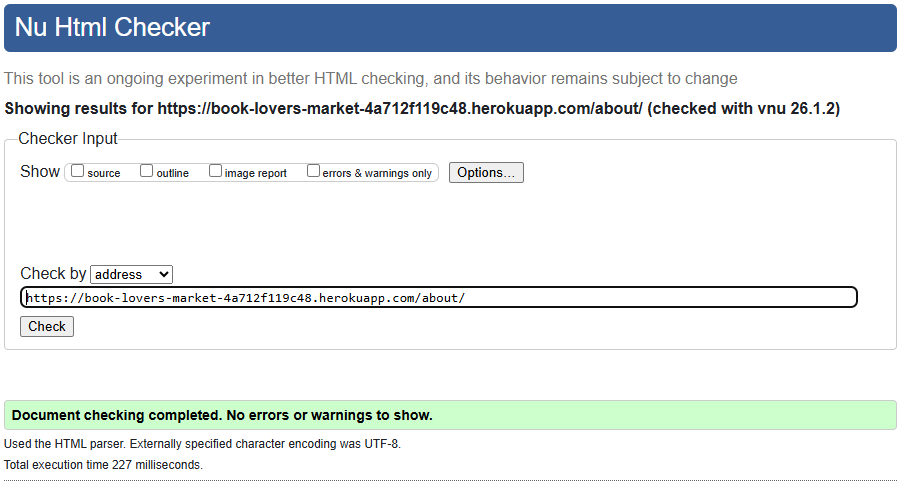 | No errors or warnings |
| pages | [home.html](https://github.com/Gary-Burke/book-lovers-market/blob/main/pages/templates/pages/home.html) | [Results Link](https://validator.w3.org/nu/?doc=https%3A%2F%2Fbook-lovers-market-4a712f119c48.herokuapp.com%2F) | 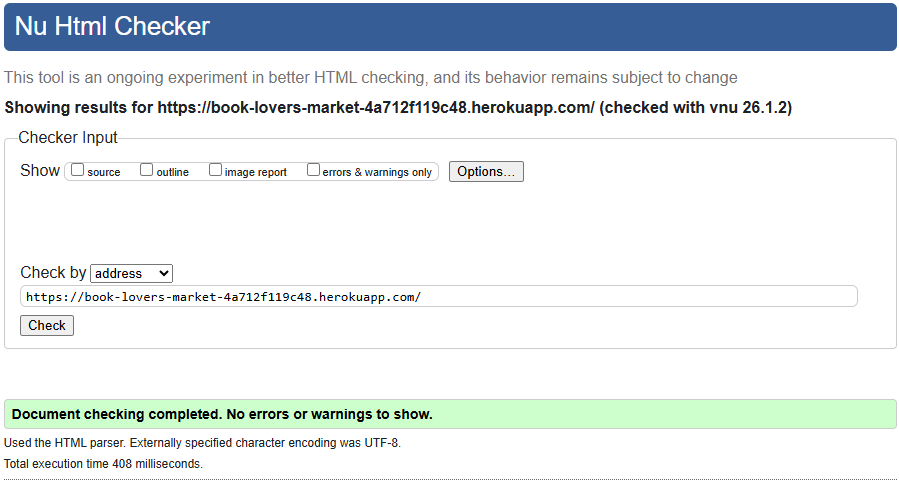 | No errors or warnings |
| templates | [login.html](https://github.com/Gary-Burke/book-lovers-market/blob/main/templates/account/login.html) | [Results Link](https://validator.w3.org/nu/?doc=https%3A%2F%2Fbook-lovers-market-4a712f119c48.herokuapp.com%2Faccounts%2Flogin%2F) | 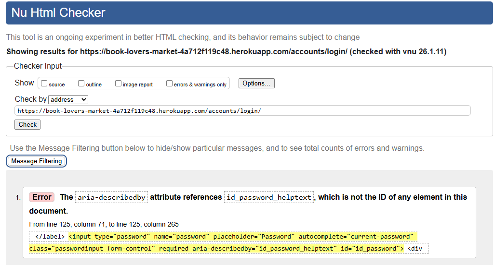 | No errors or warnings |
| templates | [logout.html](https://github.com/Gary-Burke/book-lovers-market/blob/main/templates/account/logout.html) | [Results Link](https://validator.w3.org/nu/?doc=https%3A%2F%2Fbook-lovers-market-4a712f119c48.herokuapp.com%2Faccounts%2Flogout%2F) | 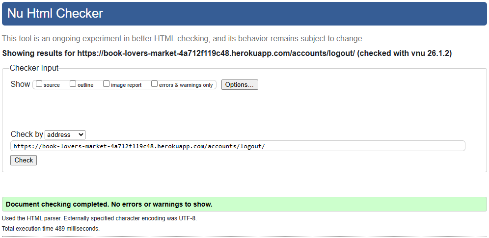 | No errors or warnings |
| templates | [signup.html](https://github.com/Gary-Burke/book-lovers-market/blob/main/templates/account/signup.html) | [Results Link](https://validator.w3.org/nu/?doc=https%3A%2F%2Fbook-lovers-market-4a712f119c48.herokuapp.com%2Faccounts%2Fsignup%2F) | 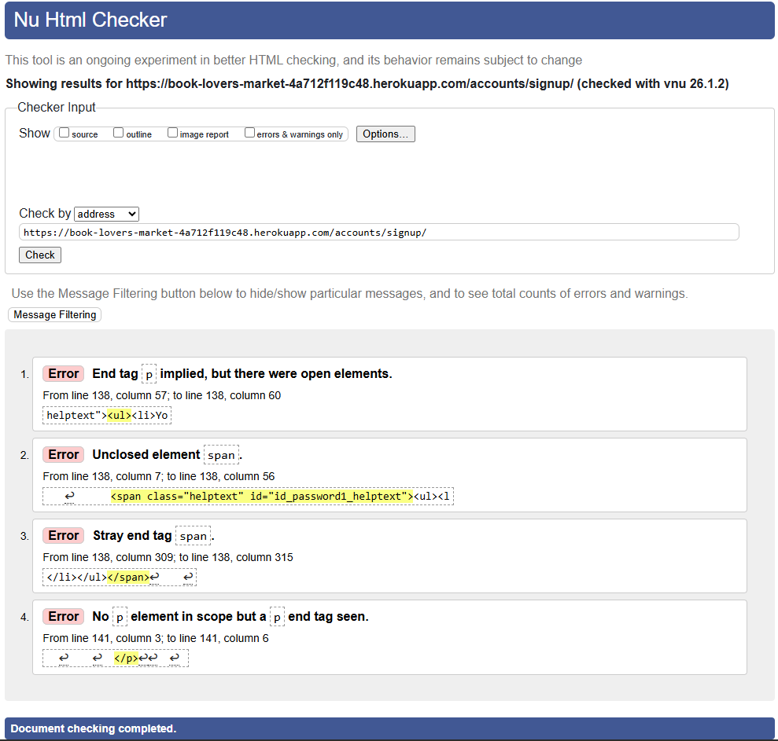 | No errors or warnings |
| templates | [password_reset.html](https://github.com/Gary-Burke/book-lovers-market/blob/main/templates/account/signup.html) | [Results Link](https://validator.w3.org/nu/?doc=https%3A%2F%2Fbook-lovers-market-4a712f119c48.herokuapp.com%2Faccounts%2Fpassword%2Freset%2F) | 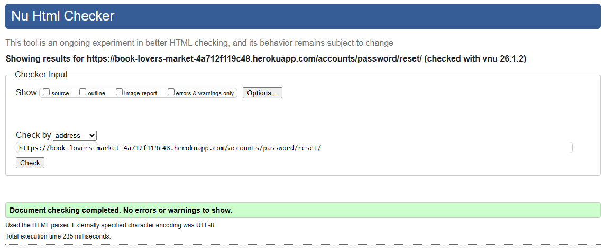 | No errors or warnings |
| templates | [password_reset_done.html](https://github.com/Gary-Burke/book-lovers-market/blob/main/templates/account/signup.html) | [Results Link](https://validator.w3.org/nu/?doc=https%3A%2F%2Fbook-lovers-market-4a712f119c48.herokuapp.com%2Faccounts%2Fpassword%2Freset%2Fdone%2F) | 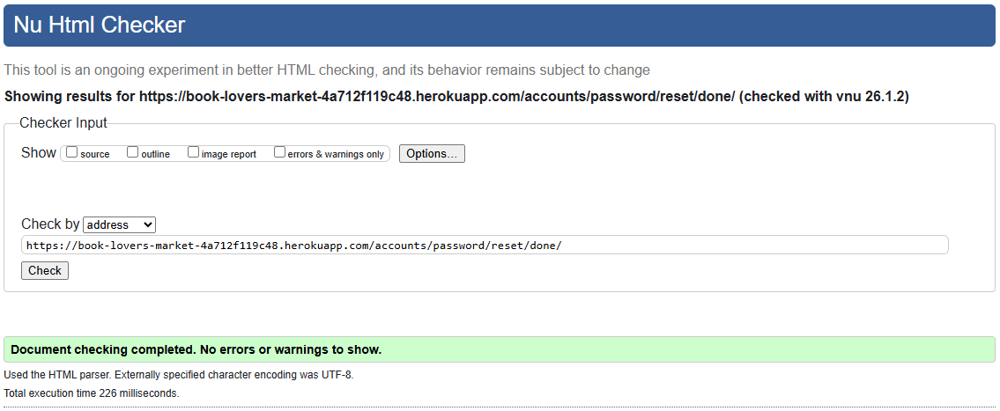 | No errors or warnings |

